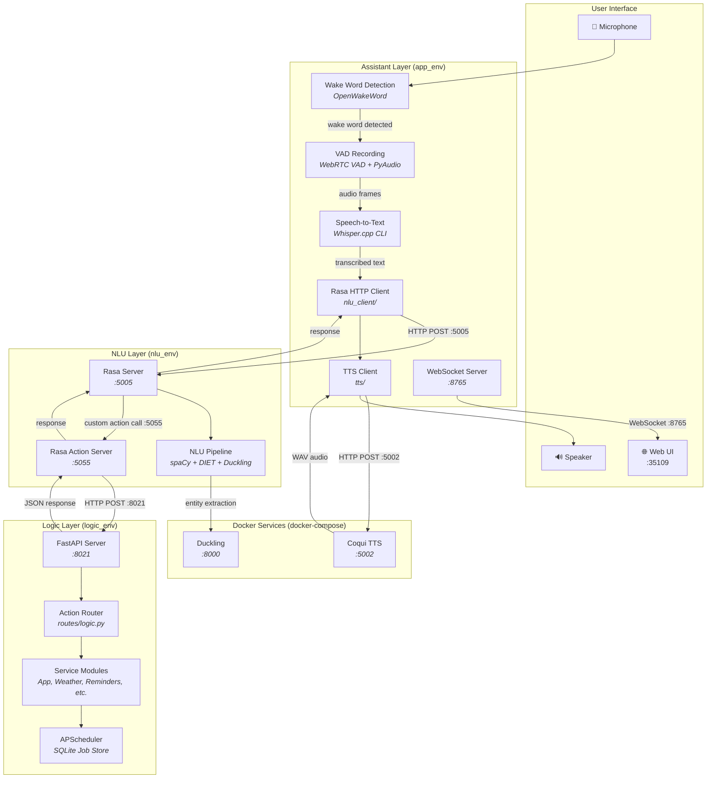
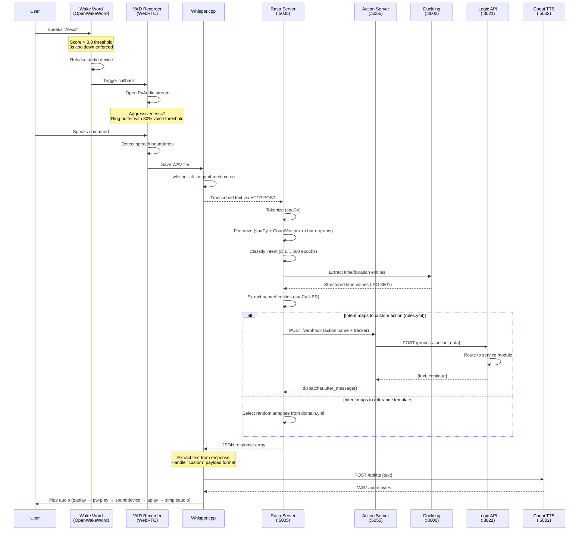
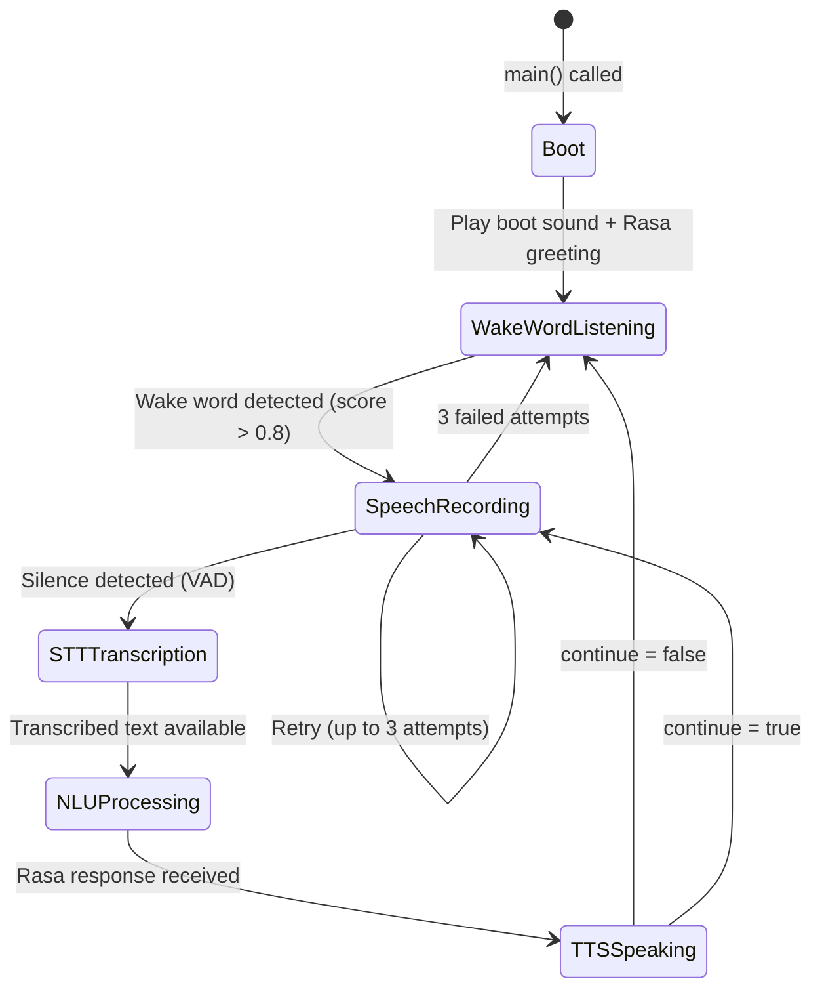
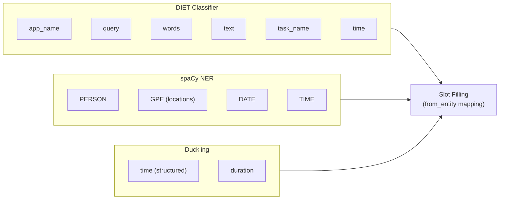
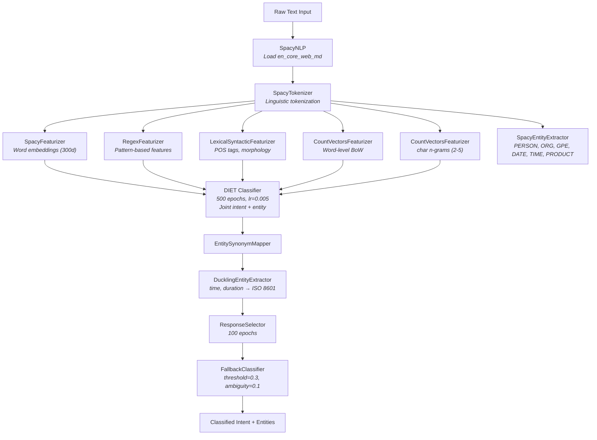
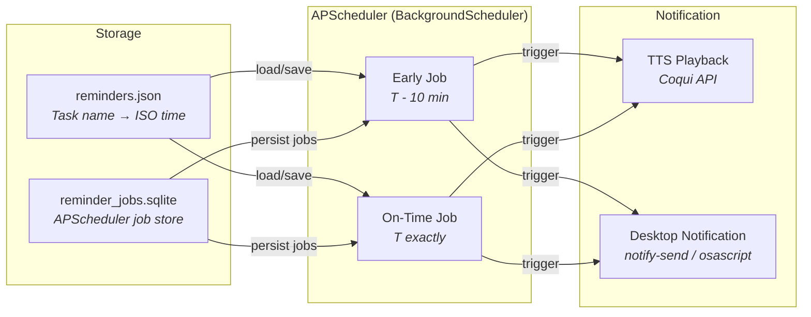

# ELISA — System Architecture

> Deep-dive into the multi-service layered architecture, component responsibilities, internal design decisions, and failure characteristics of the ELISA voice assistant.

---

## Table of Contents

- [Design Philosophy](#design-philosophy)
- [System Topology](#system-topology)
- [End-to-End Request Flow](#end-to-end-request-flow)
- [Component Analysis](#component-analysis)
  - [Assistant Layer](#1-assistant-layer)
  - [NLU Layer](#2-nlu-layer-rasa)
  - [Logic Layer](#3-logic-layer-fastapi)
  - [Infrastructure Services](#4-infrastructure-services)
- [NLU Pipeline Design](#nlu-pipeline-design)
- [Scheduler Architecture](#scheduler-architecture)
- [Failure Modes and Isolation](#failure-modes-and-isolation)
- [Port Allocation Map](#port-allocation-map)

---

## Design Philosophy

ELISA is designed around three architectural constraints:

1. **Service Isolation** — Each layer (Assistant, NLU, Logic) runs in its own process with its own Python virtual environment. There are no shared imports between layers. All inter-layer communication is over HTTP REST, making each layer independently deployable and replaceable.

2. **Unidirectional Data Flow** — Voice input flows strictly downward: Assistant → NLU → Logic. Responses propagate back up the same chain. There are no lateral calls between NLU and Assistant, and the Logic layer never initiates requests to either upstream service.

3. **Local-First Execution** — Every component in the critical voice pipeline (wake word detection, VAD, STT, intent classification, entity extraction, TTS) runs locally. External network calls are only made for opt-in features (weather API, IP-based geolocation) and never gate core functionality.

---

## System Topology

The following diagram maps the complete system topology, including all services, their ports, and communication protocols:



---

## End-to-End Request Flow

This sequence diagram traces a complete voice interaction from microphone input to audio output:



---

## Component Analysis

### 1. Assistant Layer

**Directory:** `assistant/src/`
**Virtual Environment:** `app_env/`
**Entry Point:** `main.py`

The Assistant layer is the **runtime orchestrator**. It owns the physical I/O (microphone, speaker) and sequences the voice pipeline. It contains no business logic and no language understanding — it is purely a coordination layer.

#### Internal Module Breakdown

| Module                | File                               | Responsibility                                                                                                                                                                                                                                                                                                                                                                  |
| --------------------- | ---------------------------------- | ------------------------------------------------------------------------------------------------------------------------------------------------------------------------------------------------------------------------------------------------------------------------------------------------------------------------------------------------------------------------------- |
| **Wake Word**         | `wake_word/wake_word_detection.py` | Continuously monitors the microphone for the activation hotword using OpenWakeWord. Detects the "alexa" wake word with a confidence threshold of 0.8. Manages audio device lifecycle — fully closes PyAudio before triggering the callback to prevent device contention with the VAD recorder. Implements a 3-second cooldown to prevent re-triggering from residual TTS audio. |
| **Voice Recognition** | `stt/voice_recognition.py`         | Implements VAD-based recording using WebRTC VAD (aggressiveness level 2). Uses a ring buffer to detect speech onset (80% voiced frames) and offset (90% unvoiced frames). Saves captured audio as WAV, invokes `whisper-cli` as a subprocess, and parses the text output. Provides multi-backend audio playback (paplay → pw-play → sounddevice → aplay → simpleaudio).         |
| **TTS Client**        | `tts/text_to_speech.py`            | Sends text to the Coqui TTS Docker container via `POST /api/tts`. Receives WAV bytes, writes to `shared/audio/temporary/response.wav`, and plays back using the same multi-backend strategy.                                                                                                                                                                                    |
| **NLU Client**        | `nlu_client/rasa_integration.py`   | HTTP client for Rasa's REST webhook (`POST :5005/webhooks/rest/webhook`). Sends `{sender, message}` payloads. Parses responses handling both direct `text` fields and `custom` payloads (used by Logic-backed actions). Extracts the `continue` flag to determine if the conversation loop should persist.                                                                      |
| **Session/WebSocket** | `session/websocket.py`             | Singleton `ElisaUIController` that runs a WebSocket server on `:8765`. Broadcasts state changes (`boot`, `listening`, `processing`, `speaking`, `idle`) and log entries to connected web UI clients. Uses a thread-safe message queue bridging synchronous assistant code to the async WebSocket event loop.                                                                    |

#### Main Loop Architecture



The assistant grants three attempts for speech recognition per wake word activation. If all three fail, it speaks an error message and returns to wake word listening. Conversations that set `continue: true` (e.g., after a definition lookup that offers "Want to know more?") loop back to speech recording without requiring a new wake word trigger.

#### Audio Device Management

A critical design decision: the wake word detector **fully releases the PyAudio instance** before invoking the speech recognition callback. This prevents device contention on single-microphone systems:

```
Wake Word Listener: stream.close() → p.terminate() → sleep(0.3) → callback()
Voice Recognition:  p = PyAudio() → stream = p.open() → record → stream.close() → p.terminate()
```

Both modules implement `find_working_input_device()` to probe available audio devices and gracefully fall back to the system default.

---

### 2. NLU Layer (Rasa)

**Directory:** `nlu/`
**Virtual Environment:** `nlu_env/`
**Services:** Rasa Server (`:5005`), Action Server (`:5055`)

The NLU layer owns all language understanding: tokenization, featurization, intent classification, entity extraction, and dialogue management. It is the only layer that understands natural language — both upstream (Assistant) and downstream (Logic) communicate in structured data.

#### Intent Taxonomy

The system recognizes 20 intents organized by function:

| Category           | Intents                                                                                                                 | Handling                            |
| ------------------ | ----------------------------------------------------------------------------------------------------------------------- | ----------------------------------- |
| **Conversational** | `greet`, `goodbye`, `affirm`, `deny`, `mood_great`, `mood_unhappy`, `bot_challenge`, `wake_up_elisa`, `repeat_after_me` | Utterance templates in `domain.yml` |
| **System Control** | `open_app`, `search_firefox`, `create_file`, `type_what_i_say`                                                          | Custom actions → Logic API          |
| **Information**    | `current_date_time`, `meaning_of`, `weather_update`                                                                     | Custom actions → Logic API          |
| **Reminder CRUD**  | `set_reminder`, `list_reminders`, `remove_reminder`, `update_reminder`                                                  | Custom actions → Logic API          |

#### Entity System

Entities are extracted through three complementary mechanisms:



**DIET Classifier** handles domain-specific entities annotated in training data (e.g., `Open [Chrome](app_name)`). **spaCy NER** provides general-purpose named entity recognition for persons, locations, dates. **Duckling** provides deterministic, rule-based extraction of temporal expressions — critical for the reminder system where "tomorrow at 5pm" must resolve to a precise ISO 8601 timestamp.

#### Dialogue Management

Two policy mechanisms control conversation flow:

1. **RulePolicy** — Deterministic mappings defined in `rules.yml`. Every intent that triggers a custom action has a rule (e.g., `intent: set_reminder → action: action_set_reminder`). Rules take precedence over story-based predictions.

2. **TEDPolicy + MemoizationPolicy** — Handle multi-turn conversations defined in `stories.yml` (e.g., the greeting → mood → cheer-up flow, and the definition → "want more?" → browser-open flow).

#### Session Configuration

```yaml
session_config:
  session_expiration_time: 60 # Session expires after 60 seconds of inactivity
  carry_over_slots_to_new_session: true # Slot values persist across session resets
```

---

### 3. Logic Layer (FastAPI)

**Directory:** `logic/src/`
**Virtual Environment:** `logic_env/`
**Service:** FastAPI (`:8021`)

The Logic layer is a pure HTTP API that receives structured commands and returns structured responses. It knows nothing about voice, NLU, or dialogue. This makes it testable in isolation and reusable by any client.

#### API Surface

The Logic layer exposes a single endpoint:

```
POST /process
Content-Type: application/json

{
  "action": "<ACTION_CODE>",
  "data": "<action-specific payload>"
}
```

#### Action Router

`routes/logic.py` implements a dispatcher that maps action codes to handler functions:

| Action Code        | Handler              | Service Module        | Description                                          |
| ------------------ | -------------------- | --------------------- | ---------------------------------------------------- |
| `OPEN_APP`         | `open_app()`         | `app_launcher.py`     | Cross-platform app launcher with fuzzy name matching |
| `SEARCH_BROWSER`   | `search_browser()`   | built-in              | Opens Google search in default browser               |
| `TYPE_TEXT`        | `type_text()`        | built-in              | Simulates keyboard typing via `pynput`               |
| `GET_CURRENT_TIME` | `get_current_time()` | built-in              | Returns formatted date/time                          |
| `GET_MEANING`      | `meaning_of()`       | built-in + Wikipedia  | Fetches one-sentence summary from Wikipedia          |
| `OPEN_BROWSER`     | `open_browser()`     | built-in              | Opens Wikipedia page for a term                      |
| `GET_WEATHER`      | `get_weather()`      | `weather_info.py`     | Fetches weather from OpenWeatherMap                  |
| `SET_REMINDER`     | `set_reminder()`     | `reminder_manager.py` | Creates reminder with dual scheduling                |
| `LIST_REMINDERS`   | `list_reminders()`   | `reminder_manager.py` | Returns active reminders, prunes expired             |
| `REMOVE_REMINDER`  | `remove_reminder()`  | `reminder_manager.py` | Fuzzy-matched reminder deletion                      |
| `UPDATE_REMINDER`  | `update_reminder()`  | `reminder_manager.py` | Fuzzy-matched time update                            |

#### Service Module: App Launcher

`services/app_launcher.py` implements cross-platform application launching:

- **Linux:** Scans `.desktop` files from `/usr/share/applications/`, `~/.local/share/applications/`, and uses `get_close_matches()` (cutoff 0.6) for fuzzy matching against user queries.
- **Windows:** Scans Start Menu `.lnk` shortcuts from both user and all-users directories.
- **Fallback:** Attempts to run the query as a direct executable name.

#### Service Module: Response Templates

`services/response_loader.py` loads `data/responses.yml` at import time and provides `get_random_response()` — each action's response category contains multiple templates with `{variable}` placeholders, enabling natural variation in assistant speech. Templates also carry a `continue` flag that controls whether the conversation loop stays open.

---

### 4. Infrastructure Services

Managed via `infra/docker-compose.yml` on bridge network `elisa-network`:

#### Coqui TTS (`:5002`)

- **Image:** `ghcr.io/coqui-ai/tts-cpu:v0.22.0`
- **Model:** `tts_models/en/ljspeech/glow-tts` (neural TTS, ~200ms latency for short utterances)
- **API:** `POST /api/tts` with form data `text=<utterance>` → returns raw WAV bytes
- **GPU variant** available (commented in docker-compose) using NVIDIA runtime

#### Duckling (`:8000`)

- **Image:** `rasa/duckling:0.2.0.2-r3`
- **Purpose:** Deterministic parsing of temporal expressions
- **Called by:** Rasa's `DucklingEntityExtractor` pipeline component
- **Configuration:** Locale `en_US`, timezone `Asia/Kolkata`

---

## NLU Pipeline Design

The Rasa NLU pipeline processes input through these stages in order:



**Key design decisions:**

- **Dual featurization strategy:** spaCy's 300-dimensional word embeddings capture semantic similarity, while CountVectors (both word-level and character n-gram) capture surface patterns. This combination handles both semantic paraphrases and typos.
- **DIET over pre-trained transformers:** The DIET classifier (500 epochs, dropout 0.2) provides joint intent/entity classification without requiring GPU hardware — aligned with the local-first philosophy.
- **Fallback threshold at 0.3:** Intents below 30% confidence or with less than 10% margin over the runner-up trigger Rasa's fallback behavior, preventing confident misclassification.
- **Duckling positioned late in pipeline:** Temporal entities are extracted after DIET, ensuring that Duckling only processes already-tokenized text and its structured output overwrites any conflicting DIET time extractions.

---

## Scheduler Architecture

The reminder system uses APScheduler with persistent storage:



Each reminder creates **two scheduled jobs**: an early warning 10 minutes before, and the actual reminder at the specified time. Both are persisted in SQLite, surviving server restarts. The `remind()` function sends TTS audio via the Coqui API and dispatches a platform-appropriate desktop notification (`notify-send` on Linux, `osascript` on macOS).

**Fuzzy matching** (via `difflib.get_close_matches`, cutoff 0.5) is used for reminder removal and updates, allowing users to say "remove the call mom reminder" even if the stored task is "call mom at office."

---

## Failure Modes and Isolation

Because each layer is an independent process, failures are contained:

| Failure                      | Impact                       | System Behavior                                                                                   |
| ---------------------------- | ---------------------------- | ------------------------------------------------------------------------------------------------- |
| **Logic API down**           | Custom actions fail          | Rasa Actions returns error text; conversational intents (greet, goodbye) still work               |
| **Rasa Server down**         | All NLU fails                | Assistant catches `RequestException`, speaks "trouble connecting to the server"                   |
| **Duckling down**            | Time entity extraction fails | DIET and spaCy entities still work; reminders without parseable times return an error message     |
| **TTS Docker down**          | No speech output             | `requests.exceptions.RequestException` caught; assistant continues (text still logged)            |
| **Microphone unavailable**   | No audio input               | `find_working_input_device()` probes all devices; falls back to default; logs error if none found |
| **Whisper.cpp fails**        | STT returns None             | Three retry attempts; speaks "couldn't understand you" after exhaustion                           |
| **APScheduler DB corrupted** | Reminders lost               | Scheduler initializes fresh; JSON file provides backup source of truth                            |

The Assistant layer implements a **3-attempt retry loop** for speech recognition and gracefully degrades at each stage. The wake word listener wraps its entire loop in try/except with automatic recovery, ensuring the assistant remains responsive even after transient audio errors.

---

## Port Allocation Map

| Port    | Service              | Protocol  | Owner                |
| ------- | -------------------- | --------- | -------------------- |
| `5002`  | Coqui TTS            | HTTP REST | Docker               |
| `5005`  | Rasa NLU Server      | HTTP REST | NLU Layer            |
| `5055`  | Rasa Action Server   | HTTP REST | NLU Layer            |
| `8000`  | Duckling             | HTTP REST | Docker               |
| `8021`  | FastAPI Logic API    | HTTP REST | Logic Layer          |
| `8765`  | WebSocket Server     | WebSocket | Assistant Layer      |
| `35109` | Web UI (HTTP Server) | HTTP      | Python `http.server` |

---

_This document reflects the architecture as implemented. For communication protocols and data contract specifications, see [SYSTEM_COMMUNICATION.md](SYSTEM_COMMUNICATION.md)._
