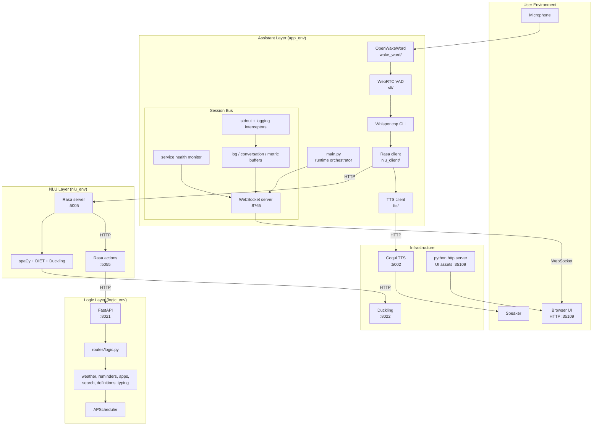
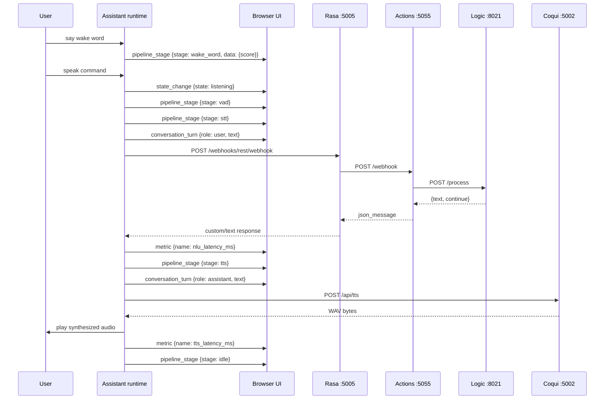
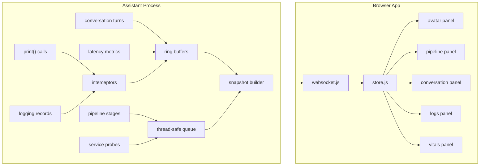
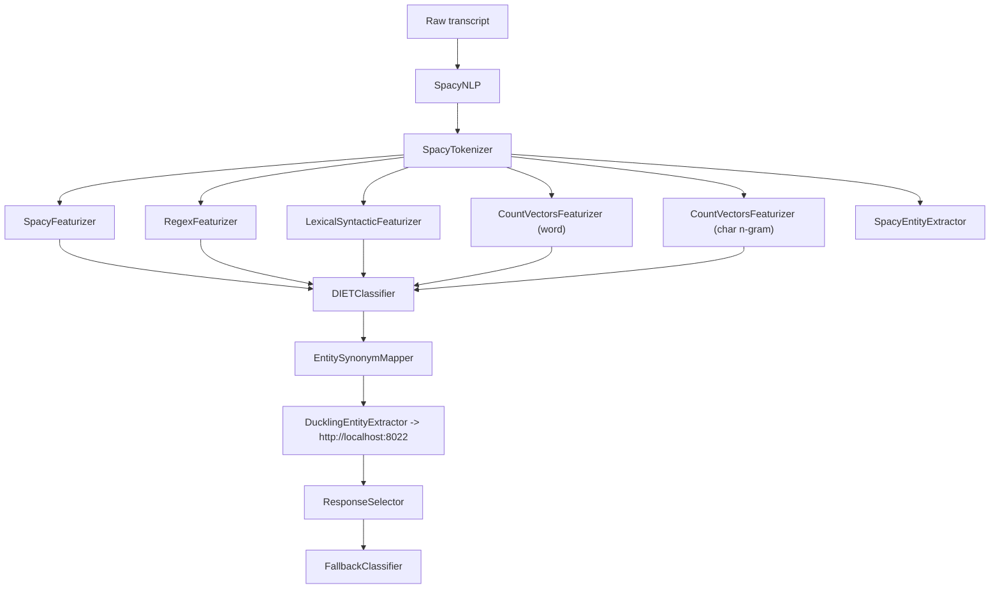
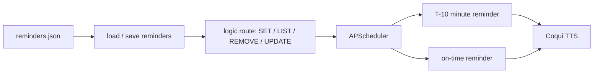

# ELISA — System Architecture

> Runtime topology, component responsibilities, session data architecture, and failure isolation for the ELISA voice assistant.

---

## Table of Contents

- [Design Philosophy](#design-philosophy)
- [System Topology](#system-topology)
- [Runtime Execution Model](#runtime-execution-model)
- [Session and UI Data Architecture](#session-and-ui-data-architecture)
- [Component Analysis](#component-analysis)
  - [Assistant Layer](#1-assistant-layer)
  - [Browser UI Surface](#2-browser-ui-surface)
  - [NLU Layer (Rasa)](#3-nlu-layer-rasa)
  - [Logic Layer (FastAPI)](#4-logic-layer-fastapi)
  - [Infrastructure Services](#5-infrastructure-services)
- [NLU Pipeline Design](#nlu-pipeline-design)
- [Reminder and Scheduler Architecture](#reminder-and-scheduler-architecture)
- [Failure Modes and Isolation](#failure-modes-and-isolation)
- [Port Allocation Map](#port-allocation-map)

---

## Design Philosophy

ELISA is built around four architectural rules.

1. **Separate execution from presentation** — The assistant owns microphone, speaker, and pipeline control. The browser UI is a read-only surface driven from assistant-published state, not a second runtime.
2. **Prefer explicit network contracts** — Assistant, NLU, and Logic do not share Python imports. They communicate through HTTP and WebSocket boundaries that can be reasoned about, logged, and replaced independently.
3. **Keep the voice path local-first** — Wake word detection, VAD, STT, NLU, entity parsing, and TTS all run locally. Remote APIs remain optional feature integrations.
4. **Model sessions as replayable state** — The UI does not depend on having been present from process start. The assistant keeps bounded buffers for logs, conversation turns, and metrics so new browser clients receive an immediate snapshot before live streaming resumes.

---

## System Topology

Two paths define the runtime:

- **Command path**: microphone input moves down through the assistant, NLU, and logic services, then returns as TTS output.
- **Session path**: assistant-side runtime events are buffered and published to the browser as snapshots plus incremental events.

This separation keeps observability rich without making the UI part of the decision-making path.

---

## Runtime Execution Model

The assistant loop is the controlling runtime abstraction.

Important runtime properties:

- Wake word detection releases the audio device before VAD recording begins, preventing input-device contention.
- STT, NLU, and TTS latencies are recorded as metrics and streamed to the UI.
- The browser sees the same session lifecycle the runtime uses internally rather than a separately computed dashboard model.
- The conversation loop is controlled by the `continue` flag returned from logic-backed or template responses, allowing follow-up turns without requiring a new wake word.

---

## Session and UI Data Architecture

The assistant session layer is a state relay, not just a socket server.

### Assistant-side model

`assistant/src/session/websocket.py` maintains the authoritative read model for the UI:

- **Log buffer**: last 500 entries
- **Conversation buffer**: last 50 turns
- **Metric buffer**: last 200 metrics
- **Service status map**: `rasa`, `logic`, `tts`, `duckling`
- **Current pipeline state**: active stage plus stage-specific payload

The session layer installs two non-invasive interceptors:

- `PrintInterceptor` mirrors `print()` output into structured log events without breaking terminal output.
- `ElisaLogHandler` mirrors Python logging records into the same stream while filtering noisy third-party chatter.

`assistant/src/session/health.py` polls backend endpoints every 10 seconds and emits `service_status` updates so the UI can display real availability instead of inferred status.

### Browser-side model

`ui/public/js/store.js` is the single client-side state container. It receives a `snapshot` on connect, then applies incremental updates from `ui/public/js/websocket.js`.

The store tracks:

- WebSocket connection state and schema version
- Current pipeline stage and recent pipeline history
- Service health, uptime, and connection status
- Log stream plus file-frequency map for filtering
- Conversation history and derived counters
- Metric histories for sparkline rendering

Every panel is downstream of that store:

- **Avatar** reflects the current stage visually.
- **Pipeline** shows stage progression and per-stage metadata.
- **Conversation** renders user and assistant turns, including metadata pills.
- **Logs** provides search, level filters, file filters, export, and alternate views.
- **Vitals** renders service health and latency sparklines.

This means a schema change must be coordinated across the assistant session bus and the browser store, not just the UI markup.

---

## Component Analysis

### 1. Assistant Layer

**Directory:** `assistant/src/`  
**Virtual environment:** `app_env/`  
**Entry point:** `main.py`

The assistant layer owns physical I/O, conversation control, and runtime observability.

| Module            | File                               | Responsibility                                                                                                                                                  |
| ----------------- | ---------------------------------- | --------------------------------------------------------------------------------------------------------------------------------------------------------------- |
| Wake word         | `wake_word/wake_word_detection.py` | Continuously scores the wake word, enforces cooldown, releases the audio device before invoking the callback, and publishes wake-word scores to the session bus |
| Voice recognition | `stt/voice_recognition.py`         | Records with WebRTC VAD, advances runtime state from `listening` to `processing`, runs Whisper.cpp, and returns transcripts                                     |
| NLU client        | `nlu_client/rasa_integration.py`   | Posts transcripts to Rasa, parses both text and custom response shapes, and reads the `continue` conversation flag                                              |
| TTS client        | `tts/text_to_speech.py`            | Calls Coqui TTS, writes `shared/audio/temporary/response.wav`, and plays audio with cascading playback backends                                                 |
| Session bus       | `session/websocket.py`             | Buffers logs, turns, metrics, and service status; builds snapshots; handles keepalive; broadcasts WebSocket events                                              |
| Health monitor    | `session/health.py`                | Polls Rasa, Logic, TTS, and Duckling endpoints and emits `service_status` events                                                                                |

The assistant's `main.py` is intentionally small: it sequences the workflow and delegates each specialized concern to dedicated modules.

### 2. Browser UI Surface

**Directory:** `ui/public/`

The browser UI is a modular, static web application. It does not own assistant logic and it does not call Rasa or Logic directly. Its job is to render the session read model published by the assistant.

| Module       | File              | Responsibility                                                                                 |
| ------------ | ----------------- | ---------------------------------------------------------------------------------------------- |
| Bootstrap    | `js/app.js`       | Starts the WebSocket client, wires global banners and pills, and initializes the panel modules |
| Transport    | `js/websocket.js` | Maintains the reconnecting WebSocket client and routes messages into the store                 |
| Shared state | `js/store.js`     | Normalizes snapshots and incremental messages into one browser-side state tree                 |
| Panels       | `js/panels/*.js`  | Render independent views for avatar, pipeline, conversation, logs, and vitals                  |
| Presentation | `css/`            | Separates reset, design system, layout, animation, and per-panel styling                       |

This panel-based layout keeps the UI extensible. A new visual surface should subscribe to the existing store rather than opening a new connection or duplicating parsing logic.

### 3. NLU Layer (Rasa)

**Directory:** `nlu/`  
**Virtual environment:** `nlu_env/`  
**Services:** Rasa Server (`:5005`), Action Server (`:5055`)

The NLU layer owns natural language interpretation and dialogue policy.

- `config.yml` defines the spaCy, DIET, Duckling, and fallback pipeline.
- `domain.yml` defines intents, slots, entities, and responses.
- `data/` holds training examples, rules, and stories.
- `actions/actions.py` maps structured tracker state to logic actions.
- `actions/logic_integration.py` translates those actions into the Logic API contract.

The assistant treats the NLU layer as a pure text-in, message-out service.

### 4. Logic Layer (FastAPI)

**Directory:** `logic/src/`  
**Virtual environment:** `logic_env/`  
**Service:** FastAPI (`:8021`)

The logic layer receives structured commands and returns structured response objects.

- `routes/logic.py` dispatches action codes such as `OPEN_APP`, `GET_WEATHER`, `SET_REMINDER`, and `UPDATE_REMINDER`.
- `services/` contains the concrete business behaviors.
- `scheduler/` persists reminder jobs through APScheduler.
- `data/` stores reminder data and response templates.

Because it does not depend on microphone, speaker, or Rasa internals, the logic layer can be tested in isolation.

### 5. Infrastructure Services

Managed through `infra/docker-compose.yml` and the startup scripts.

| Service          | Port    | Role                                                                     |
| ---------------- | ------- | ------------------------------------------------------------------------ |
| Coqui TTS        | `5002`  | Text-to-speech API used by the assistant loop and reminder notifications |
| Duckling         | `8022`  | Temporal entity parsing for Rasa                                         |
| Static UI server | `35109` | Serves `ui/public/` through Python `http.server`                         |

The infrastructure layer remains intentionally small. Its purpose is to host the supporting services that the local-first assistant depends on.

---

## NLU Pipeline Design

Key implementation choices:

- spaCy embeddings and count-vector features are combined so the model handles both semantics and surface-form variation.
- DIET handles joint intent classification and domain-specific entities without requiring transformer-scale infrastructure.
- Duckling resolves relative times into deterministic ISO timestamps, which is essential for reminder scheduling.
- Fallback policies reduce confident misclassification when the transcript is ambiguous.

---

## Reminder and Scheduler Architecture

Each reminder creates two jobs: an early warning and the scheduled reminder itself. APScheduler persists jobs, while JSON storage remains the human-readable source of reminder data.

Reminder notifications are the one place where the logic layer directly uses the TTS API. That is intentional: reminder delivery should still work even when the main assistant interaction loop is idle.

---

## Failure Modes and Isolation

| Failure                               | Impact                             | Behavior                                                                              |
| ------------------------------------- | ---------------------------------- | ------------------------------------------------------------------------------------- |
| Rasa unavailable                      | Assistant cannot classify commands | Assistant reports an upstream error and returns to idle                               |
| Logic unavailable                     | Logic-backed actions fail          | Conversational templates still work; custom actions return an error response          |
| Duckling unavailable                  | Temporal entity parsing degrades   | Reminder commands fail when time expressions cannot be resolved                       |
| TTS unavailable                       | Speech output fails                | Errors are logged and published to the UI; text responses still exist in the pipeline |
| WebSocket/UI unavailable              | Browser observability disappears   | Voice assistant runtime continues; the UI reconnects when the bus returns             |
| Microphone or audio-device contention | Input capture fails                | Wake word module and VAD recorder aggressively release and reacquire devices          |
| Whisper failure                       | Transcript missing                 | Assistant retries speech capture up to three times before giving up                   |

The services are intentionally independent so observability failure does not become assistant failure, and UI absence does not break the voice path.

---

## Port Allocation Map

| Port    | Service             | Protocol  | Owner               |
| ------- | ------------------- | --------- | ------------------- |
| `5002`  | Coqui TTS           | HTTP      | Infrastructure      |
| `5005`  | Rasa Server         | HTTP      | NLU                 |
| `5055`  | Rasa Action Server  | HTTP      | NLU                 |
| `8021`  | Logic API           | HTTP      | Logic               |
| `8022`  | Duckling            | HTTP      | Infrastructure      |
| `8765`  | Session bus         | WebSocket | Assistant           |
| `35109` | Web UI asset server | HTTP      | Startup script / UI |

---

_For payload shapes, snapshot structure, and protocol-level examples, see [SYSTEM_COMMUNICATION.md](SYSTEM_COMMUNICATION.md)._
