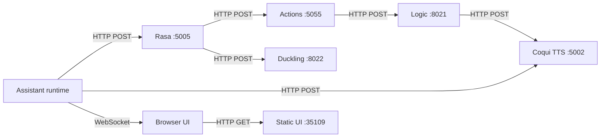
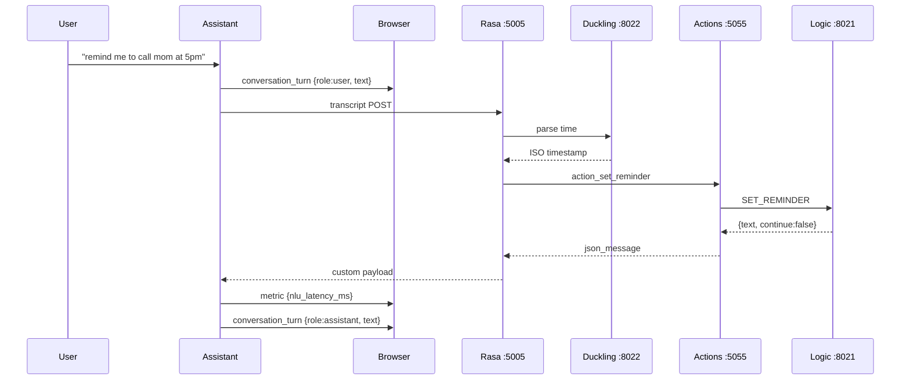
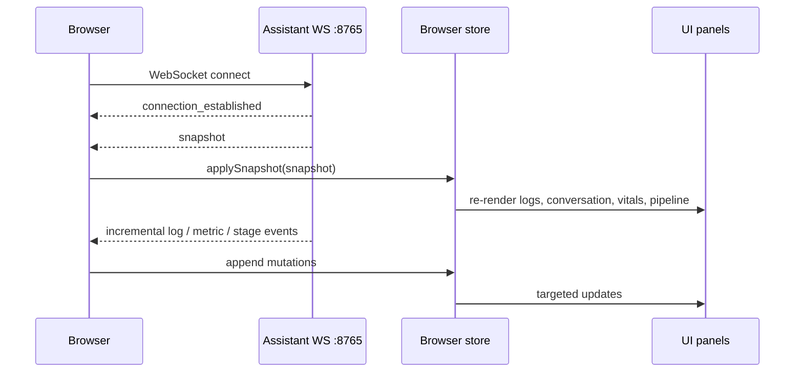

# ELISA — System Communication

> Network protocols, payload contracts, session snapshots, and UI state propagation across the ELISA architecture.

---

## Table of Contents

- [Communication Overview](#communication-overview)
- [Protocol Map](#protocol-map)
- [Interface 1: Assistant -> Rasa NLU](#interface-1-assistant---rasa-nlu)
- [Interface 2: Rasa -> Action Server](#interface-2-rasa---action-server)
- [Interface 3: Action Server -> Logic API](#interface-3-action-server---logic-api)
- [Interface 4: Assistant or Logic -> Coqui TTS](#interface-4-assistant-or-logic---coqui-tts)
- [Interface 5: Rasa Pipeline -> Duckling](#interface-5-rasa-pipeline---duckling)
- [Interface 6: Assistant Session Bus -> Browser UI](#interface-6-assistant-session-bus---browser-ui)
- [Interface 7: Static UI Delivery](#interface-7-static-ui-delivery)
- [Complete Data Flow Examples](#complete-data-flow-examples)
- [State Management](#state-management)
- [Error Propagation](#error-propagation)

---

## Communication Overview

ELISA uses two protocol families:

- **Synchronous HTTP** for command execution across Assistant, NLU, Logic, TTS, and Duckling.
- **Persistent WebSocket** for session state streaming from the assistant to the browser UI.

There is also one shared filesystem boundary: the assistant writes generated speech to `shared/audio/temporary/response.wav`, and permanent sound assets live under `shared/audio/permanent/`.



---

## Protocol Map

| Interface                | From               | To            | Protocol  | Content type                        | Port    |
| ------------------------ | ------------------ | ------------- | --------- | ----------------------------------- | ------- |
| Transcript submission    | Assistant          | Rasa Server   | HTTP POST | `application/json`                  | `5005`  |
| Custom action execution  | Rasa Server        | Action Server | HTTP POST | `application/json`                  | `5055`  |
| Business action dispatch | Action Server      | Logic API     | HTTP POST | `application/json`                  | `8021`  |
| Speech synthesis         | Assistant or Logic | Coqui TTS     | HTTP POST | `application/x-www-form-urlencoded` | `5002`  |
| Temporal parsing         | Rasa pipeline      | Duckling      | HTTP POST | `application/x-www-form-urlencoded` | `8022`  |
| Session streaming        | Assistant          | Browser UI    | WebSocket | JSON messages                       | `8765`  |
| UI asset delivery        | Static HTTP server | Browser UI    | HTTP GET  | HTML, CSS, JS, images               | `35109` |

---

## Interface 1: Assistant -> Rasa NLU

**Endpoint:** `POST http://localhost:5005/webhooks/rest/webhook`  
**Source:** `assistant/src/nlu_client/rasa_integration.py`

### Request

```json
{
  "sender": "user1",
  "message": "remind me to call mom at 5pm"
}
```

| Field     | Type     | Meaning                                        |
| --------- | -------- | ---------------------------------------------- |
| `sender`  | `string` | Conversation identifier used by Rasa's tracker |
| `message` | `string` | Raw transcript from Whisper.cpp                |

### Response shapes

Rasa may return plain text messages:

```json
[
  {
    "recipient_id": "user1",
    "text": "Hey there! What can I do for you?"
  }
]
```

Or logic-backed custom payloads:

```json
[
  {
    "recipient_id": "user1",
    "custom": {
      "text": ["Reminder set for call mom at 05:00 PM."],
      "continue": false
    }
  }
]
```

`assistant/src/nlu_client/rasa_integration.py` normalizes both shapes into:

- `messages: string[]`
- `continue_conversation: boolean`

The `continue` flag controls whether the assistant stays in the active conversation loop after speaking the response.

---

## Interface 2: Rasa -> Action Server

**Endpoint:** `POST http://localhost:5055/webhook`  
**Source:** Rasa SDK protocol

Rasa sends the full tracker state when it predicts a custom action.

### Representative request

```json
{
  "next_action": "action_set_reminder",
  "sender_id": "user1",
  "tracker": {
    "slots": {
      "task_name": "call mom",
      "time": "2026-04-30T17:00:00+05:30"
    },
    "latest_message": {
      "intent": {
        "name": "set_reminder",
        "confidence": 0.95
      },
      "entities": [
        {
          "entity": "task_name",
          "value": "call mom",
          "extractor": "DIETClassifier"
        },
        {
          "entity": "time",
          "value": "2026-04-30T17:00:00+05:30",
          "extractor": "DucklingEntityExtractor"
        }
      ],
      "text": "remind me to call mom at 5pm"
    }
  }
}
```

### Action behavior

The action classes in `nlu/actions/actions.py` do three things:

1. read slots or latest entities from the tracker
2. normalize values into the Logic API's action/data shape
3. call `dispatcher.utter_message(json_message=response)` so the Logic API response returns to the assistant as a `custom` payload

This keeps the action server thin and consistent: dialogue policy stays in Rasa, business behavior stays in Logic.

---

## Interface 3: Action Server -> Logic API

**Endpoint:** `POST http://localhost:8021/process`  
**Source:** `nlu/actions/logic_integration.py`

### Request schema

```json
{
  "action": "SET_REMINDER",
  "data": "call mom||2026-04-30T17:00:00+05:30"
}
```

| Field    | Type     | Meaning                                                     |
| -------- | -------- | ----------------------------------------------------------- |
| `action` | `string` | Fixed action code understood by `logic/src/routes/logic.py` |
| `data`   | `string` | Action-specific payload                                     |

### Action code reference

Here is the corrected markdown table:

| Action | Data format | Example |
| :--- | :--- | :--- |
| `OPEN_APP` | `<app_name>` | `"chrome"` |
| `SEARCH_BROWSER` | `<query>` | `"python tutorials"` |
| `TYPE_TEXT` | `<text>` | `"hello world"` |
| `GET_CURRENT_TIME` | `""` | `""` |
| `GET_MEANING` | `<word>` | `"entropy"` |
| `OPEN_BROWSER` | `<term>` | `"entropy"` |
| `GET_WEATHER` | `<city>` or `""` | `"Tokyo"` |
| `SET_REMINDER` | `<task> \| <iso_time>` | `"call mom \| 2026-04-30T17:00:00+05:30"` |
| `LIST_REMINDERS` | `""` | `""` |
| `REMOVE_REMINDER` | `<task>` | `"call mom"` |
| `UPDATE_REMINDER` | `<task> \| <new_iso_time>` | `"call mom \| 2026-04-30T18:00:00+05:30"` |

### Response schema

```json
{
  "text": "Reminder set for call mom at 05:00 PM.",
  "continue": false
}
```

`logic_integration.py` wraps this into the Rasa custom-response shape:

```json
{
  "text": ["Reminder set for call mom at 05:00 PM."],
  "continue": false
}
```

---

## Interface 4: Assistant or Logic -> Coqui TTS

**Endpoint:** `POST http://localhost:5002/api/tts`  
**Sources:** `assistant/src/tts/text_to_speech.py`, `logic/src/services/reminder_manager.py`

### Request

```http
POST /api/tts
Content-Type: application/x-www-form-urlencoded

text=The+current+temperature+in+Tokyo+is+18+degrees+Celsius
```

### Response

```http
HTTP/1.1 200 OK
Content-Type: audio/wav

<binary wav payload>
```

The assistant writes the returned bytes to `shared/audio/temporary/response.wav` and plays the file using the first working backend in this order:

```text
paplay -> pw-play -> sounddevice -> aplay -> simpleaudio
```

The logic layer calls the same TTS API for reminder notifications scheduled outside the main assistant interaction loop.

---

## Interface 5: Rasa Pipeline -> Duckling

**Endpoint:** `POST http://localhost:8022/parse`  
**Source:** Rasa `DucklingEntityExtractor`

### Request

```http
POST /parse
Content-Type: application/x-www-form-urlencoded

locale=en_US&text=remind+me+at+5pm+tomorrow&dims=%5B%22time%22%2C%22duration%22%5D&tz=Asia%2FKolkata
```

### Response

```json
[
  {
    "body": "at 5pm tomorrow",
    "dim": "time",
    "value": {
      "value": "2026-05-01T17:00:00.000+05:30",
      "grain": "hour",
      "type": "value"
    }
  }
]
```

Duckling converts natural temporal language into structured ISO timestamps. ELISA relies on this for reminder creation and reminder updates where correctness matters more than model intuition.

Configured in `nlu/config.yml`:

```yaml
- name: DucklingEntityExtractor
  url: http://localhost:8022
  dimensions: ["time", "duration"]
  locale: "en_US"
  timezone: "Asia/Kolkata"
  timeout: 3
```

---

## Interface 6: Assistant Session Bus -> Browser UI

**Endpoint:** `ws://localhost:8765`  
**Source:** `assistant/src/session/websocket.py`  
**Client:** `ui/public/js/websocket.js`

This interface is the runtime data-sharing backbone for the UI.

### Connection model

On each connection the assistant sends:

1. `connection_established`
2. `snapshot`

After that, the client receives incremental events until disconnect.

### `connection_established`

```json
{
  "type": "connection_established",
  "schema_version": 1,
  "timestamp": "2026-04-30T12:00:00.000000+00:00"
}
```

### `snapshot`

```json
{
  "type": "snapshot",
  "schema_version": 1,
  "state": "processing",
  "pipeline_stage": "nlu",
  "pipeline_data": {
    "command": "what's the weather in tokyo"
  },
  "services": {
    "rasa": "up",
    "logic": "up",
    "tts": "up",
    "duckling": "up"
  },
  "uptime_seconds": 214,
  "log_buffer": [
    {
      "level": "INFO",
      "message": "Processing command with Rasa: 'what's the weather in tokyo'",
      "source_file": "assistant/src/main.py",
      "line": 91,
      "func": "assistant_workflow",
      "module": "main",
      "logger": "__main__",
      "timestamp": "2026-04-30T12:00:00.100000+00:00"
    }
  ],
  "conversation_buffer": [
    {
      "role": "user",
      "text": "what's the weather in tokyo",
      "metadata": null,
      "timestamp": "2026-04-30T12:00:00.000000+00:00"
    }
  ],
  "metric_buffer": [
    {
      "name": "stt_latency_ms",
      "value": 842,
      "unit": "ms",
      "timestamp": "2026-04-30T11:59:59.900000+00:00"
    }
  ],
  "timestamp": "2026-04-30T12:00:00.120000+00:00"
}
```

### Incremental server-to-client event families

#### Pipeline stage

```json
{
  "type": "pipeline_stage",
  "stage": "stt",
  "data": {
    "transcript": "what's the weather in tokyo"
  },
  "timestamp": "2026-04-30T12:00:00.050000+00:00"
}
```

#### State change

```json
{
  "type": "state_change",
  "state": "listening",
  "module": "system",
  "timestamp": "2026-04-30T11:59:58.000000+00:00"
}
```

#### Conversation turn

```json
{
  "type": "conversation_turn",
  "role": "assistant",
  "text": "The current temperature in Tokyo is 18 degrees Celsius with overcast clouds.",
  "metadata": {
    "latency_ms": 134
  },
  "timestamp": "2026-04-30T12:00:00.400000+00:00"
}
```

#### Metric

```json
{
  "type": "metric",
  "name": "nlu_latency_ms",
  "value": 134,
  "unit": "ms",
  "timestamp": "2026-04-30T12:00:00.300000+00:00"
}
```

#### Service status

```json
{
  "type": "service_status",
  "service": "duckling",
  "status": "up",
  "timestamp": "2026-04-30T12:00:10.000000+00:00"
}
```

#### Log event

```json
{
  "type": "log",
  "level": "INFO",
  "message": "Wake word detected! (score: 0.91)",
  "source_file": "assistant/src/wake_word/wake_word_detection.py",
  "line": 145,
  "func": "listen_for_wake_word",
  "module": "wake_word_detection",
  "logger": "wake_word.wake_word_detection",
  "timestamp": "2026-04-30T11:59:57.800000+00:00"
}
```

#### Error event

```json
{
  "type": "error",
  "source": "nlu",
  "message": "Failed to process command: Connection refused",
  "traceback": "Traceback ...",
  "timestamp": "2026-04-30T12:02:00.000000+00:00"
}
```

#### Keepalive

```json
{
  "type": "ping",
  "timestamp": "2026-04-30T12:00:25.000000+00:00"
}
```

The client responds with `pong`, and the client also sends its own `ping` periodically.

### Client-to-server messages

| Type               | Purpose                                          |
| ------------------ | ------------------------------------------------ |
| `ping`             | Client liveness check                            |
| `request_snapshot` | Forces the server to resend the current snapshot |

### Transport behavior

- Assistant-side synchronous code writes to a thread-safe queue.
- The WebSocket server drains that queue from an asyncio event loop.
- Idle connections are kept alive with periodic `ping` messages.
- The browser reconnects with exponential backoff and reapplies state from the next snapshot.

---

## Interface 7: Static UI Delivery

**Endpoint:** `GET http://localhost:35109/`  
**Source:** `python -m http.server 35109 --directory ui/public`

This interface serves the browser application itself:

- `index.html`
- panel-specific CSS
- modular JavaScript entrypoints and panel renderers
- images and other static assets

The static UI server is intentionally dumb. Runtime state comes from the WebSocket bus, not from server-side templates or REST polling.

---

## Complete Data Flow Examples

### Example A: Reminder creation



### Example B: Browser connects mid-session



---

## State Management

State exists in two tiers.

### Tier 1: Assistant-authoritative session state

`assistant/src/session/websocket.py` maintains:

- current pipeline stage and stage payload
- current runtime state
- service health map
- log buffer
- conversation buffer
- metric buffer

This tier is authoritative because it lives next to the runtime that produces the data.

### Tier 2: Browser read model

`ui/public/js/store.js` derives browser-facing state:

- connection status and schema version
- service statuses including `ws`
- pipeline history for visual progression
- `fileMap` for log filtering
- counters for turns, commands, errors, logs, and average latency
- rolling metric series for sparklines

The browser store is intentionally ephemeral. If the page reloads, it rebuilds itself entirely from the next server snapshot plus live events.

---

## Error Propagation

ELISA surfaces failures at the boundary where they occur.

| Failure point        | Propagation path                               | User-visible effect                                            |
| -------------------- | ---------------------------------------------- | -------------------------------------------------------------- |
| Assistant -> Rasa    | `requests` exception in `rasa_integration.py`  | Assistant speaks a connectivity failure message                |
| Action -> Logic      | `requests` exception in `logic_integration.py` | Rasa action returns a structured failure response              |
| Assistant -> TTS     | Exception in `text_to_speech.py`               | Error log and possible silent response playback failure        |
| Duckling parsing     | Missing or malformed time value                | Reminder actions return guidance about time formatting         |
| Session bus          | `send_error()` event over WebSocket            | UI can show a toast or error surface while assistant continues |
| Service health probe | `service_status` becomes `down`                | Vitals panel reflects the failing dependency                   |

The communication model is designed so the assistant can continue operating even when the UI is disconnected, and the UI can reconnect without corrupting runtime state.

---

_For component responsibilities and topology, see [ARCHITECTURE.md](ARCHITECTURE.md)._
