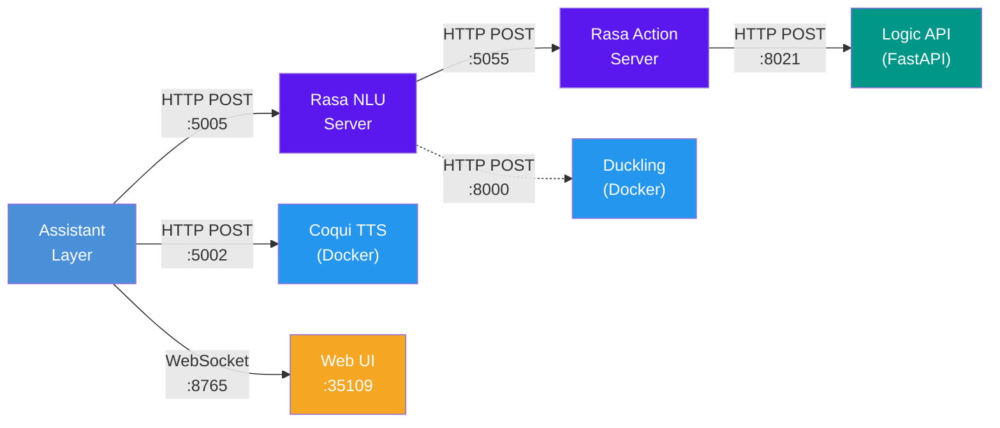
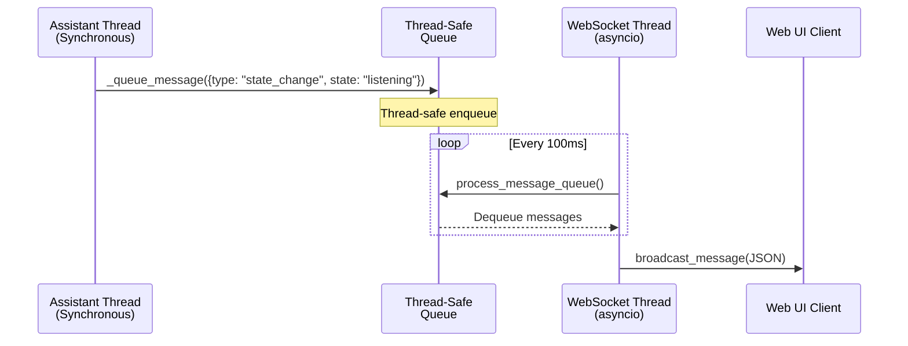
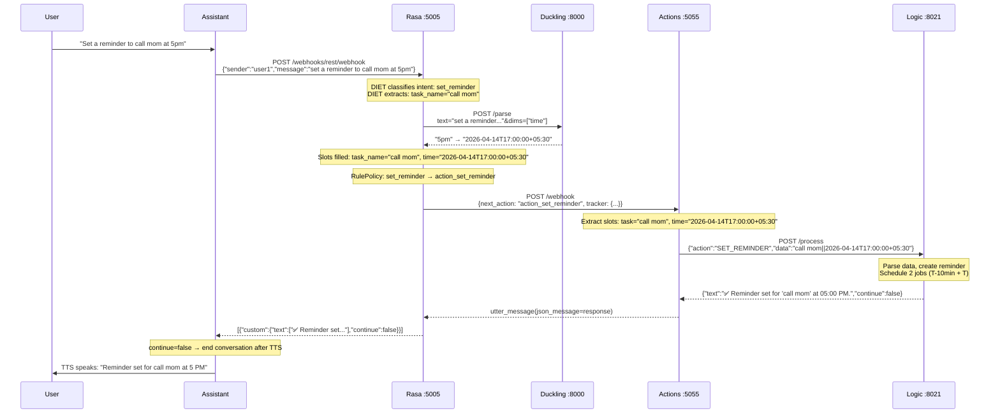
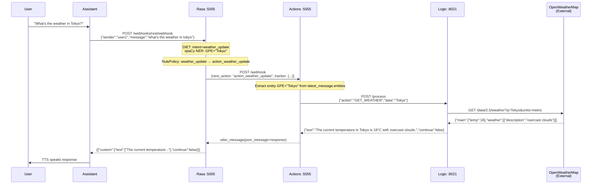
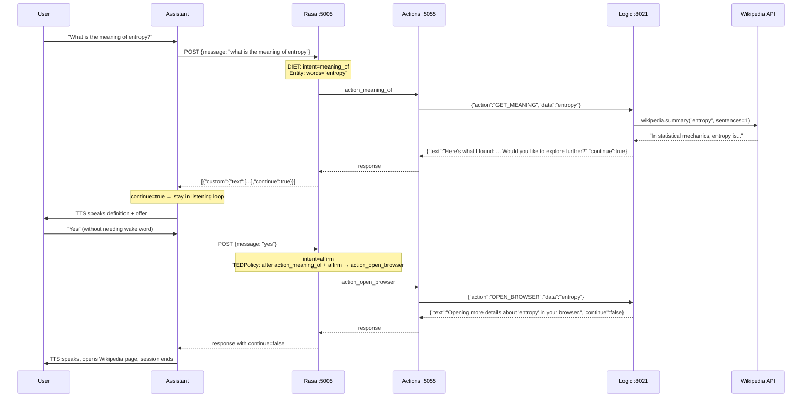
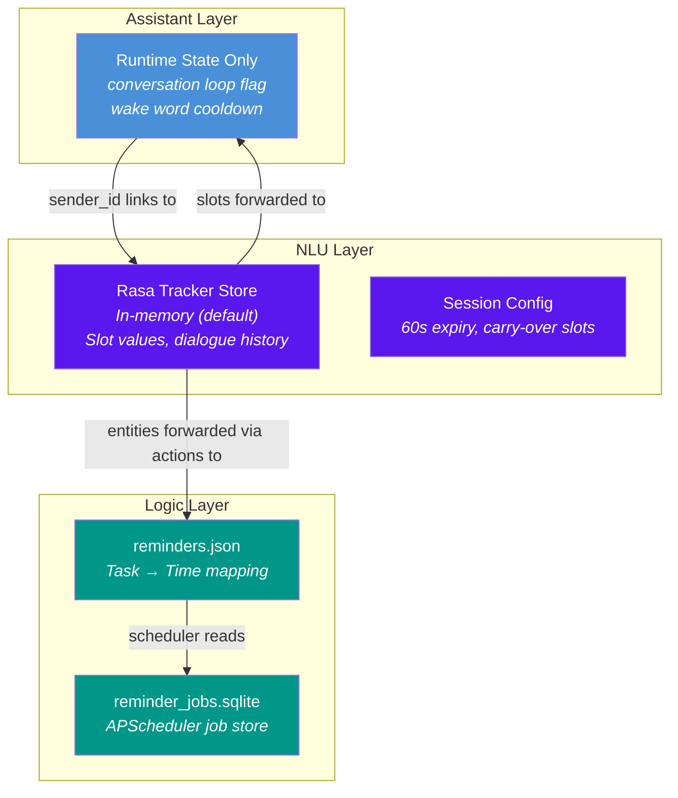
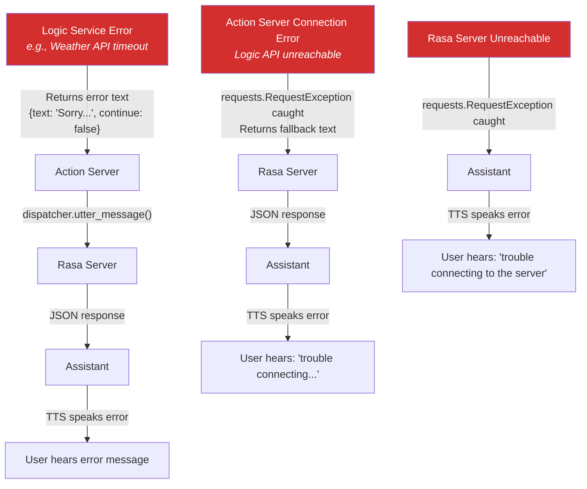

# ELISA — System Communication

> Protocols, data contracts, JSON payload specifications, and state management across the ELISA multi-service architecture.

---

## Table of Contents

- [Communication Overview](#communication-overview)
- [Protocol Map](#protocol-map)
- [Interface 1: Assistant → Rasa NLU](#interface-1-assistant--rasa-nlu)
- [Interface 2: Rasa → Action Server](#interface-2-rasa--action-server)
- [Interface 3: Action Server → Logic API](#interface-3-action-server--logic-api)
- [Interface 4: Assistant → Coqui TTS](#interface-4-assistant--coqui-tts)
- [Interface 5: Rasa Pipeline → Duckling](#interface-5-rasa-pipeline--duckling)
- [Interface 6: WebSocket (Assistant → UI)](#interface-6-websocket-assistant--ui)
- [Complete Data Flow Examples](#complete-data-flow-examples)
- [State Management](#state-management)
- [Error Propagation](#error-propagation)

---

## Communication Overview

ELISA's services communicate exclusively through network protocols — there are no shared libraries, imports, or in-memory references between layers. This section documents every interface.



---

## Protocol Map

| Interface         | From              | To            | Protocol  | Content-Type                        | Port |
| ----------------- | ----------------- | ------------- | --------- | ----------------------------------- | ---- |
| NLU Request       | Assistant         | Rasa Server   | HTTP POST | `application/json`                  | 5005 |
| Custom Action     | Rasa Server       | Action Server | HTTP POST | `application/json`                  | 5055 |
| Logic Processing  | Action Server     | FastAPI       | HTTP POST | `application/json`                  | 8021 |
| Speech Synthesis  | Assistant / Logic | Coqui TTS     | HTTP POST | `application/x-www-form-urlencoded` | 5002 |
| Entity Extraction | Rasa Pipeline     | Duckling      | HTTP POST | `application/x-www-form-urlencoded` | 8000 |
| UI State Stream   | Assistant         | Web UI        | WebSocket | `application/json`                  | 8765 |

---

## Interface 1: Assistant → Rasa NLU

**Endpoint:** `POST http://localhost:5005/webhooks/rest/webhook`
**Source:** `assistant/src/nlu_client/rasa_integration.py`
**Protocol:** HTTP REST (synchronous)

### Request

```json
{
  "sender": "user1",
  "message": "remind me to call mom at 5pm"
}
```

| Field     | Type     | Description                                                                                                                       |
| --------- | -------- | --------------------------------------------------------------------------------------------------------------------------------- |
| `sender`  | `string` | Unique conversation identifier. Defaults to `"user1"`. Rasa uses this to maintain per-sender dialogue state in its tracker store. |
| `message` | `string` | Raw transcribed text from Whisper.cpp STT.                                                                                        |

### Response — Utterance Template (no custom action)

When the intent maps to a built-in Rasa utterance (e.g., `greet` → `utter_greet`):

```json
[
  {
    "recipient_id": "user1",
    "text": "Hey there! What's up?"
  }
]
```

### Response — Custom Action (Logic-backed)

When the intent triggers a custom action that calls the Logic API, the response includes a `custom` payload:

```json
[
  {
    "recipient_id": "user1",
    "custom": {
      "text": ["✅ Reminder set for 'call mom' at 05:00 PM."],
      "continue": false
    }
  }
]
```

| Field             | Type       | Description                                                                                            |
| ----------------- | ---------- | ------------------------------------------------------------------------------------------------------ |
| `recipient_id`    | `string`   | Echoes the sender ID                                                                                   |
| `text`            | `string`   | Direct text response (utterance templates)                                                             |
| `custom`          | `object`   | Structured payload from Logic API (custom actions)                                                     |
| `custom.text`     | `string[]` | Response text(s) to be spoken via TTS                                                                  |
| `custom.continue` | `boolean`  | If `true`, the assistant remains in the conversation loop without requiring a new wake word activation |

### Response Parsing Logic

The Assistant's `rasa_integration.py` handles both formats:

```
1. If message has "text" key → extract directly
2. If message has "custom" key → extract custom.text and custom.continue
3. Multiple messages in array → concatenate all extracted text
```

---

## Interface 2: Rasa → Action Server

**Endpoint:** `POST http://localhost:5055/webhook`
**Source:** Rasa SDK framework (automatic)
**Protocol:** HTTP REST (Rasa's internal custom action protocol)

This interface is managed by Rasa's SDK. When Rasa's dialogue manager predicts a custom action (e.g., `action_set_reminder`), it posts the full tracker state to the action server.

### Request (Rasa SDK Internal)

```json
{
  "next_action": "action_set_reminder",
  "sender_id": "user1",
  "tracker": {
    "sender_id": "user1",
    "slots": {
      "task_name": "call mom",
      "time": "2026-04-14T17:00:00.000+05:30"
    },
    "latest_message": {
      "intent": {
        "name": "set_reminder",
        "confidence": 0.95
      },
      "entities": [
        {
          "entity": "task_name",
          "value": "call mom",
          "start": 14,
          "end": 22,
          "extractor": "DIETClassifier"
        },
        {
          "entity": "time",
          "value": "2026-04-14T17:00:00.000+05:30",
          "start": 26,
          "end": 29,
          "extractor": "DucklingEntityExtractor",
          "additional_info": {
            "grain": "hour",
            "type": "value"
          }
        }
      ],
      "text": "remind me to call mom at 5pm"
    },
    "events": [],
    "active_loop": null
  },
  "domain": {}
}
```

**Key observations:**

- The `tracker.slots` contain entity values mapped via `domain.yml`'s `from_entity` slot mappings.
- Duckling entities include `additional_info` with grain and type metadata.
- The tracker carries the full conversation history, enabling multi-turn context.

### Response (Action Server → Rasa)

```json
{
  "events": [],
  "responses": [
    {
      "text": null,
      "json_message": {
        "text": ["✅ Reminder set for 'call mom' at 05:00 PM."],
        "continue": false
      }
    }
  ]
}
```

The action classes use `dispatcher.utter_message(json_message=response)` which places the Logic API's response into the `json_message` field. Rasa then forwards this as a `custom` payload to the original caller.

---

## Interface 3: Action Server → Logic API

**Endpoint:** `POST http://localhost:8021/process`
**Source:** `nlu/actions/logic_integration.py`
**Protocol:** HTTP REST (synchronous)

This is the bridge between NLU decisions and business logic execution.

### Request Schema

```json
{
  "action": "SET_REMINDER",
  "data": "call mom||2026-04-14T17:00:00.000+05:30"
}
```

| Field    | Type     | Description                                           |
| -------- | -------- | ----------------------------------------------------- |
| `action` | `string` | Action code from a fixed vocabulary (see table below) |
| `data`   | `string` | Action-specific payload. Format varies by action.     |

### Action Code Reference

| Action Code        | Data Format                | Example Data                              |
| ------------------ | -------------------------- | ----------------------------------------- |
| `OPEN_APP`         | `<app_name>`               | `"chrome"`                                |
| `SEARCH_BROWSER`   | `<search_query>`           | `"python tutorials"`                      |
| `TYPE_TEXT`        | `<text_to_type>`           | `"hello world"`                           |
| `GET_CURRENT_TIME` | `""` (empty)               | `""`                                      |
| `GET_MEANING`      | `<word>`                   | `"entropy"`                               |
| `OPEN_BROWSER`     | `<wikipedia_term>`         | `"entropy"`                               |
| `GET_WEATHER`      | `<city_name>` or `""`      | `"Tokyo"` or `""` (auto-detect)           |
| `SET_REMINDER`     | `<task>\|\|<iso_time>`     | `"call mom\|\|2026-04-14T17:00:00+05:30"` |
| `LIST_REMINDERS`   | `""` (empty)               | `""`                                      |
| `REMOVE_REMINDER`  | `<task_name>`              | `"call mom"`                              |
| `UPDATE_REMINDER`  | `<task>\|\|<new_iso_time>` | `"call mom\|\|2026-04-14T18:00:00+05:30"` |

**Note:** Compound data fields (reminders) use `||` as the delimiter between task name and time value.

### Response Schema

```json
{
  "text": "✅ Reminder set for 'call mom' at 05:00 PM.",
  "continue": false
}
```

| Field      | Type      | Description                                                                           |
| ---------- | --------- | ------------------------------------------------------------------------------------- |
| `text`     | `string`  | Human-readable response text to be spoken via TTS                                     |
| `continue` | `boolean` | Whether the assistant should remain in conversation mode after speaking this response |

### Example: Weather Query

**Request:**

```json
{
  "action": "GET_WEATHER",
  "data": "Tokyo"
}
```

**Response (success):**

```json
{
  "text": "The current temperature in Tokyo is 18°C with overcast clouds.",
  "continue": false
}
```

**Response (location not found):**

```json
{
  "text": "Sorry, I couldn't fetch the weather for Tookyo. Please check the city name and try again.",
  "continue": false
}
```

### Example: Definition Lookup

**Request:**

```json
{
  "action": "GET_MEANING",
  "data": "entropy"
}
```

**Response:**

```json
{
  "text": "Here's what I found about 'entropy': In statistical mechanics, entropy is a measure of the number of possible microscopic configurations of the individual atoms and molecules of the system. Would you like to explore this word further in your browser?",
  "continue": true
}
```

Note `continue: true` — this prompts the assistant to continue listening for a follow-up (`affirm` → open browser, `deny` → end conversation).

### Example: List Reminders

**Request:**

```json
{
  "action": "LIST_REMINDERS",
  "data": ""
}
```

**Response:**

```json
{
  "text": "Here are your current reminders:\n• call mom at 05:00 PM\n• team standup at 09:30 AM\n. Would you like to update the time for a task or remove one?",
  "continue": true
}
```

---

## Interface 4: Assistant → Coqui TTS

**Endpoint:** `POST http://localhost:5002/api/tts`
**Source:** `assistant/src/tts/text_to_speech.py` and `logic/src/services/reminder_manager.py`
**Protocol:** HTTP REST

### Request

```
POST /api/tts HTTP/1.1
Content-Type: application/x-www-form-urlencoded

text=The+current+temperature+in+Tokyo+is+18+degrees+Celsius
```

| Field  | Type     | Description                                            |
| ------ | -------- | ------------------------------------------------------ |
| `text` | `string` | Plain text to synthesize. Sent as form data, not JSON. |

### Response

```
HTTP/1.1 200 OK
Content-Type: audio/wav

<binary WAV data>
```

The raw WAV bytes are written to `shared/audio/temporary/response.wav` and played through the system's audio output using a priority-cascading playback strategy:

```
paplay → pw-play → sounddevice → aplay → simpleaudio
```

**Two callers use this API:**

1. **Assistant TTS Client** — For speaking responses in the main conversation loop.
2. **Reminder Manager** — For speaking reminder notifications triggered by APScheduler jobs. This is the only case where the Logic layer directly calls the TTS API (bypassing the assistant).

---

## Interface 5: Rasa Pipeline → Duckling

**Endpoint:** `POST http://localhost:8000/parse`  
**Source:** Rasa's `DucklingEntityExtractor` pipeline component (automatic)
**Protocol:** HTTP REST

### Request (Rasa Internal)

```
POST /parse HTTP/1.1
Content-Type: application/x-www-form-urlencoded

locale=en_US&text=remind+me+at+5pm+tomorrow&dims=%5B%22time%22%2C%22duration%22%5D&tz=Asia%2FKolkata
```

| Field    | Type       | Description                                                 |
| -------- | ---------- | ----------------------------------------------------------- |
| `locale` | `string`   | `en_US` — configured in `config.yml`                        |
| `text`   | `string`   | The full input utterance                                    |
| `dims`   | `string[]` | `["time", "duration"]` — the temporal dimensions to extract |
| `tz`     | `string`   | `Asia/Kolkata` — timezone for relative time resolution      |

### Response

```json
[
  {
    "body": "at 5pm tomorrow",
    "start": 12,
    "end": 27,
    "dim": "time",
    "latent": false,
    "value": {
      "values": [
        {
          "value": "2026-04-15T17:00:00.000+05:30",
          "grain": "hour",
          "type": "value"
        }
      ],
      "value": "2026-04-15T17:00:00.000+05:30",
      "grain": "hour",
      "type": "value"
    }
  }
]
```

Duckling resolves relative temporal expressions ("tomorrow", "in 30 minutes", "next Tuesday") into absolute ISO 8601 timestamps using the configured timezone. The `grain` field indicates the precision level (second, minute, hour, day, week, month, year).

**Configuration in `config.yml`:**

```yaml
- name: DucklingEntityExtractor
  url: http://localhost:8022 # Duckling service URL
  dimensions: ["time", "duration"]
  locale: "en_US"
  timezone: "Asia/Kolkata"
  timeout: 3 # 3-second timeout
```

---

## Interface 6: WebSocket (Assistant → UI)

**Endpoint:** `ws://localhost:8765`
**Source:** `assistant/src/session/websocket.py`
**Protocol:** WebSocket (bidirectional, persistent)

The WebSocket server runs inside the Assistant layer as a singleton (`ElisaUIController`). It broadcasts real-time state and log data to any connected Web UI clients.

### Message Types

#### State Change

```json
{
  "type": "state_change",
  "state": "listening",
  "module": "Main",
  "timestamp": "2026-04-14T10:30:00.123456"
}
```

| State        | Meaning                           |
| ------------ | --------------------------------- |
| `boot`       | System initializing               |
| `listening`  | Waiting for speech input          |
| `processing` | NLU classification in progress    |
| `speaking`   | TTS playback active               |
| `idle`       | Session ended, awaiting wake word |

#### Log Entry

```json
{
  "type": "log",
  "level": "info",
  "message": "Command recognized: 'what time is it'",
  "module": "VoiceRecognition",
  "timestamp": "2026-04-14T10:30:05.456789"
}
```

| Level     | Usage                            |
| --------- | -------------------------------- |
| `info`    | Normal operations                |
| `success` | Operation completed successfully |
| `warning` | Non-fatal issues                 |
| `error`   | Operation failures               |

#### Connection Established

Sent to each client upon WebSocket connection:

```json
{
  "type": "connection_established",
  "message": "Connected to Elisa Assistant",
  "timestamp": "2026-04-14T10:30:00.000000"
}
```

### Thread Safety

The WebSocket server runs in its own thread with a dedicated `asyncio` event loop. The Assistant's synchronous code uses `ElisaUIController._queue_message()` to enqueue messages into a thread-safe `queue.Queue`. The async `process_message_queue()` coroutine polls this queue every 100ms and broadcasts messages to all connected clients.



---

## Complete Data Flow Examples

### Example A: "Set a reminder to call mom at 5pm"



### Example B: "What's the weather in Tokyo?"



### Example C: "What is the meaning of entropy?" (Multi-Turn)



---

## State Management

### Rasa Tracker Store (Dialogue State)

Rasa maintains per-sender conversation state in its **tracker store**. By default, ELISA uses the in-memory tracker store (configured in `endpoints.yml` with tracker store lines commented out).

**What the tracker holds:**

- Complete event history for the conversation
- Current slot values (filled from entities)
- Active dialogue loop state
- Last received message with parsed intent and entities

**Session lifecycle:**

```yaml
session_config:
  session_expiration_time: 60 # Session resets after 60s inactivity
  carry_over_slots_to_new_session: true # Slot values survive session resets
```

After 60 seconds of inactivity, Rasa creates a new session but carries slot values forward. This means entity values extracted in a previous exchange (e.g., a reminder task name) remain available in subsequent conversations.

**Limitation:** The in-memory tracker store means all dialogue history is lost when the Rasa server restarts. For production, `endpoints.yml` contains commented-out configurations for Redis and MongoDB tracker stores.

### Logic Layer State

The Logic layer maintains two forms of persistent state:

1. **Reminder Storage** (`logic/src/data/reminders/reminders.json`)  
   A JSON file mapping task names to ISO 8601 timestamps. Read/written by `reminder_manager.py` on every CRUD operation. Serves as the source of truth for active reminders.

2. **Scheduler Job Store** (`logic/src/data/reminders/reminder_jobs.sqlite`)  
   SQLite database managed by APScheduler. Persists scheduled jobs (both early-warning and on-time triggers) across server restarts. The scheduler starts automatically when the Logic layer boots.

### Assistant Layer State

The Assistant layer maintains minimal runtime state:

- **Conversation loop flag** — The `continue_conversation` boolean from Rasa responses controls whether the assistant loops back to speech recording or returns to wake word listening.
- **Wake word cooldown** — A timestamp tracking the last activation, enforcing a 3-second cooldown to prevent double-triggering from TTS playback.
- **WebSocket client set** — The set of connected UI clients, managed in the `ElisaUIController` singleton.

There is **no persistent state** in the Assistant layer. Every conversation starts fresh after a wake word activation.

### State Flow Across Layers



**Cross-layer state correlation:** The `sender` ID (`"user1"`) in the Assistant's Rasa requests maps to a Rasa tracker, which maintains conversation state across multiple exchanges within a session. The Logic layer is stateless per-request — it reads/writes to persistent files but maintains no in-memory state about who is calling.

---

## Error Propagation

Errors propagate outward from their origin, with each layer catching and translating them:



**Key error handling points:**

| Layer                  | File                    | Error Strategy                                                                                                 |
| ---------------------- | ----------------------- | -------------------------------------------------------------------------------------------------------------- |
| `logic_integration.py` | Action → Logic bridge   | `try/except RequestException` → returns `{"text": "trouble connecting to the LOGIC layer", "continue": false}` |
| `rasa_integration.py`  | Assistant → Rasa bridge | `try/except RequestException` → returns `(["trouble connecting to the server"], false)`                        |
| `text_to_speech.py`    | Assistant → TTS         | `try/except RequestException` → prints error, continues silently                                               |
| `main.py`              | Main loop               | Three-attempt retry for STT; catches all exceptions in wake word loop                                          |

No layer ever raises an unhandled exception to its caller over the network. Every error is caught, translated to a human-readable text response, and propagated back as a normal response with `continue: false` to end the conversation gracefully.

---

_This document reflects the communication contracts as implemented. For the architectural overview and component analysis, see [ARCHITECTURE.md](ARCHITECTURE.md)._
